# **Приложение мониторинга цен яндекс такси**

Планировщик YandexScheduler каждые 30 секунд делает запрос к **Api Yandex Taxi** , получает цену на поездку и сохраняет
данные в базу данных. Получить список всех цен можно по end point /prices. В приложении реализованы пользовательские
метрики: стоимость поездки, время работы планировщика, время получение данных от api yandex taxi и время чтения данных
из базы данных. Помимо мониторинга пользовательских метрик реализован мониторинг 4 золотых сигналов.
Мониториг приложения реализован инструментами actuator, prometheus, grafana.

**Как воспроизвести приложение**

После клонирования проекта перейти в директорию **yandexTaxi** и собрать билд проекта командой

```bash
    mvn clean package
```

Далее запустить докер контейнеры командой

```bash
docker-compose -f docker-compose.yml up
```

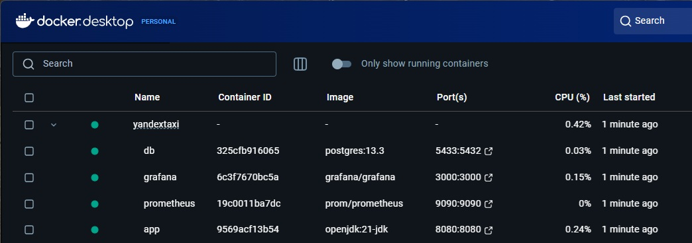

Проверить работу приложения GET запросом к end point /prices  c  помощью встроенного в intellij idea http клиента и файла prices.http


Список метрик доступен по http://localhost:8080/actuator/prometheus

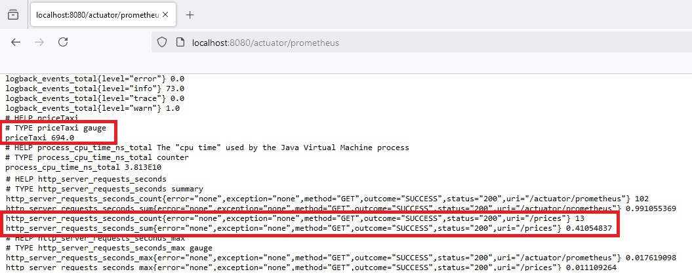

Подать нагрузку на приложение с помощью JMeter (конфигурационный файл prices.jmx)

Открыть grafana по адресу http://localhost:3000/ (логин/пароль: admin) и открыть список доступных дашбордов.

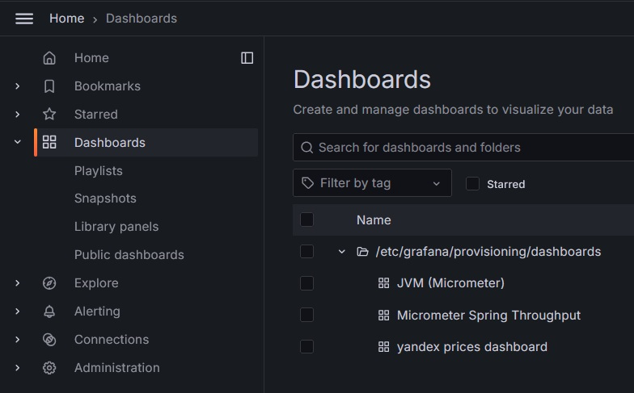


**Saturation golden signal**

Показывает на сколько загружена система, мониторинг доступен по дашборду **JVM (Micrometer)**

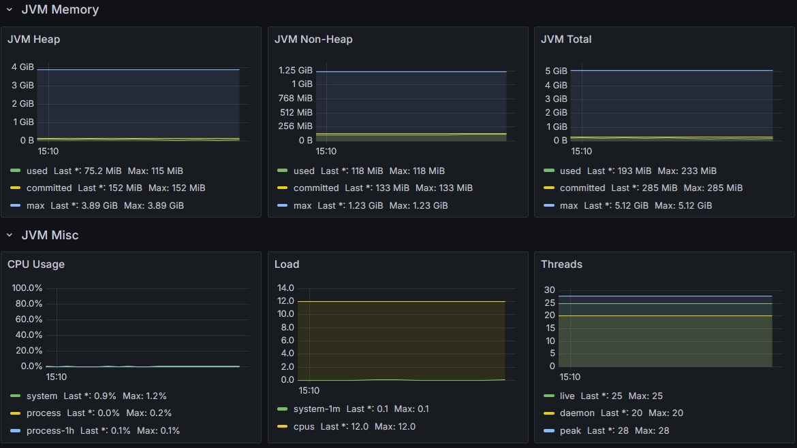


**Latency, Traffic, Errors golden signals**

Latency показывает как долго обрабатывается запрос

Traffic показывает сколько запросов в секунду приходит

Errors показывает сколько запросов завершается с ошибкой

Мониторинг доступен по дашборду **Micrometer Spring Throughput**

**Requests per second**

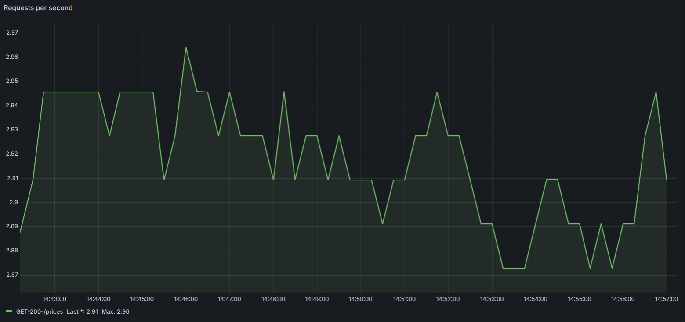

```bash
rate(http_server_requests_seconds_count{application="$application", instance="$instance", uri!~".*actuator.*"}[1m])
```

**Mean response time**

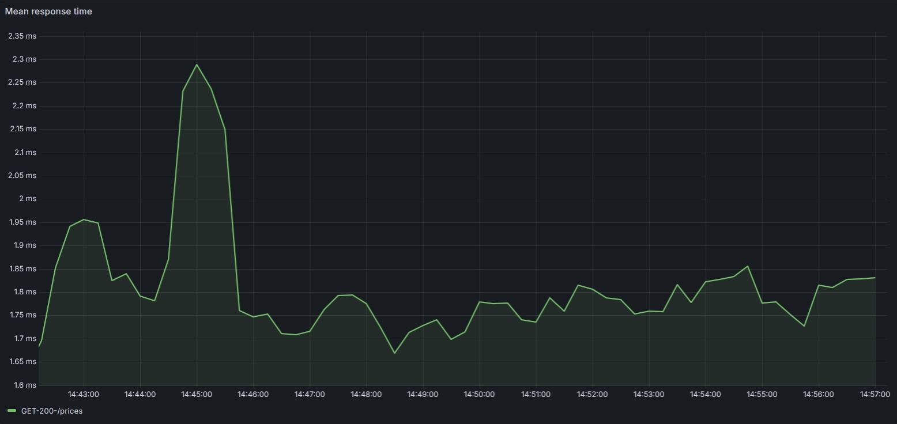

```bash
rate(http_server_requests_seconds_sum{application="$application", instance="$instance", uri!~".*actuator.*"}[1m])/rate(http_server_requests_seconds_count{application="$application", instance="$instance", uri!~".*actuator.*"}[1m])
```

Response time of 50%, 75%, 90%, 95% of requests

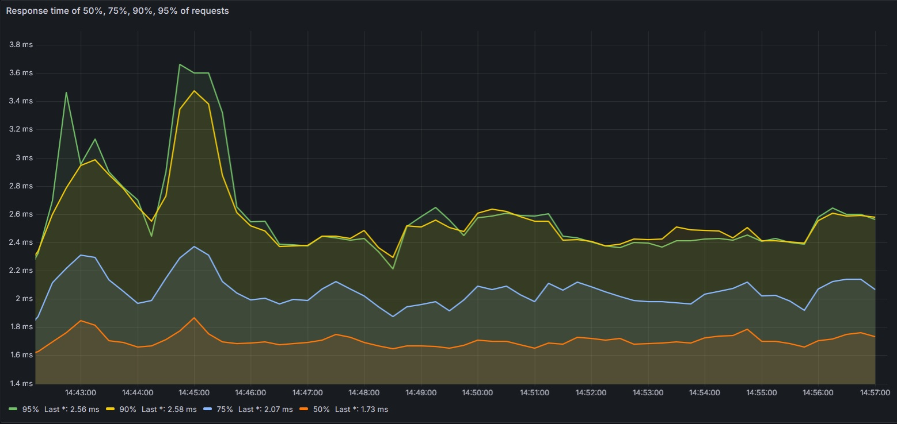

```bash
histogram_quantile(0.95, sum(rate(http_server_requests_seconds_bucket{application="$application", instance="$instance", uri!~".*actuator.*"}[1m])) by (le))
```

Top 10 APIs

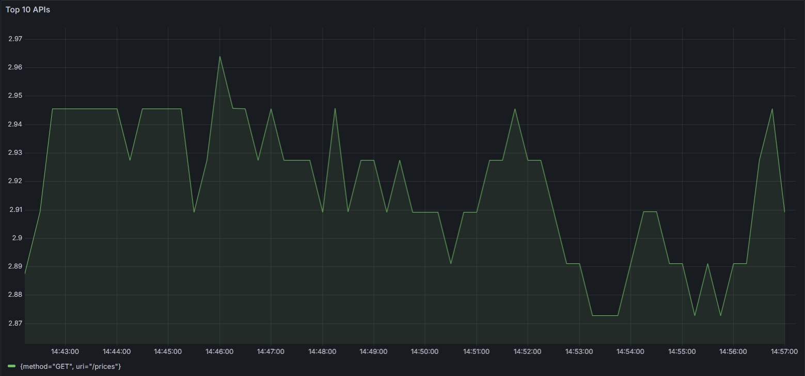

```bash
topk(10, sum by(uri, method) (rate(http_server_requests_seconds_count{application="$application",  uri!~".*actuator.*"}[1m])))
```

Errors

```bash
100*(sum(rate(http_server_requests_seconds_count{application="$application", instance="$instance", uri!~".*actuator.*", status=~"4..|5.."} [10s])) by (uri) / sum(rate(http_server_requests_seconds_count {application="$application", instance="$instance", uri!~".*actuator.*"} [10s])) by (uri))
```

Пользовательские метрики. Мониторинг доступен по дашборду **yandex prices dashboard**

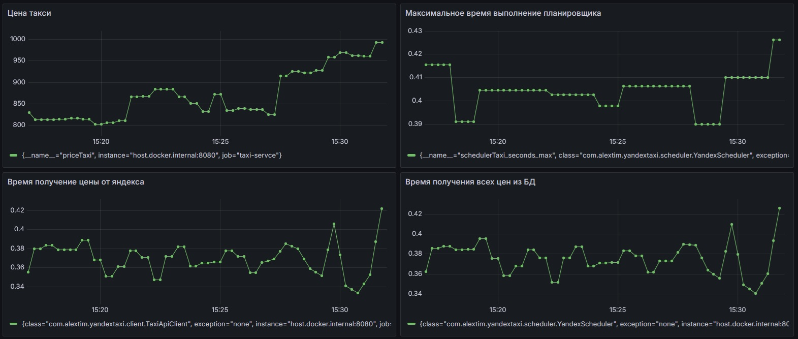

Цена поездки яндекс такси

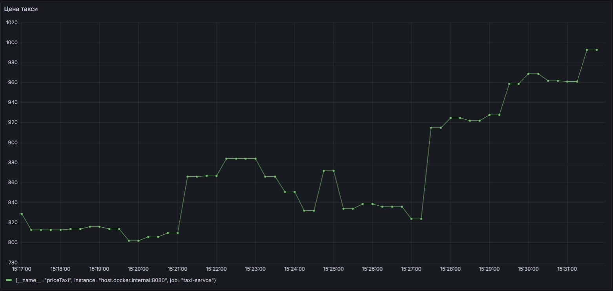

```bash
priceTaxi
```

Максимальное время выполнение планировщика 

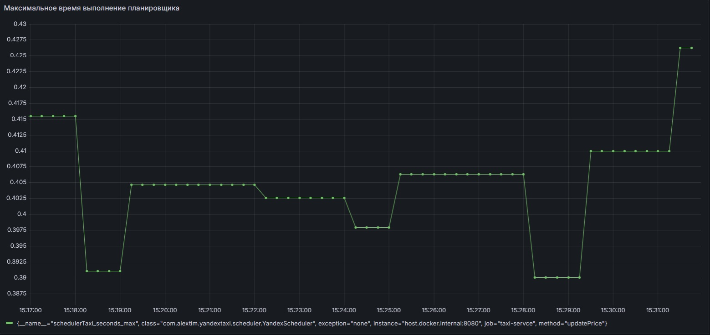

```bash
schedulerTaxi_seconds_max
```

